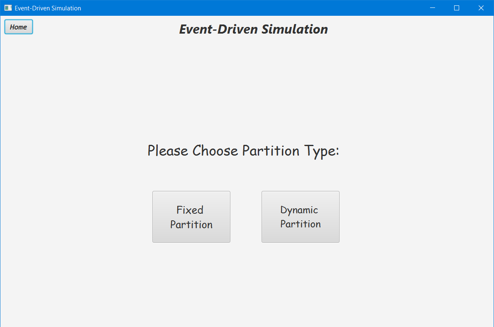
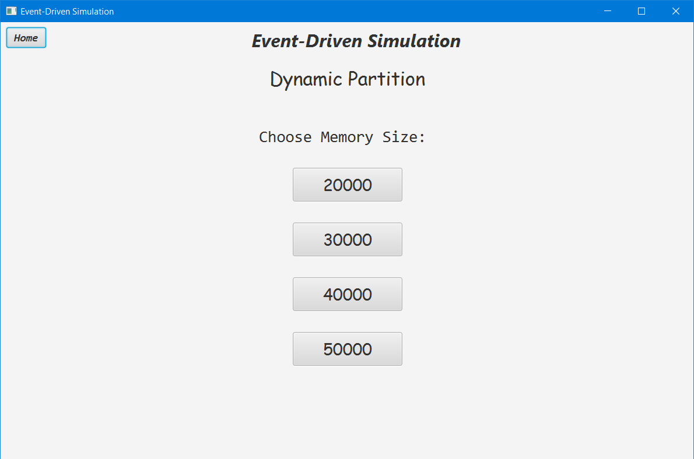
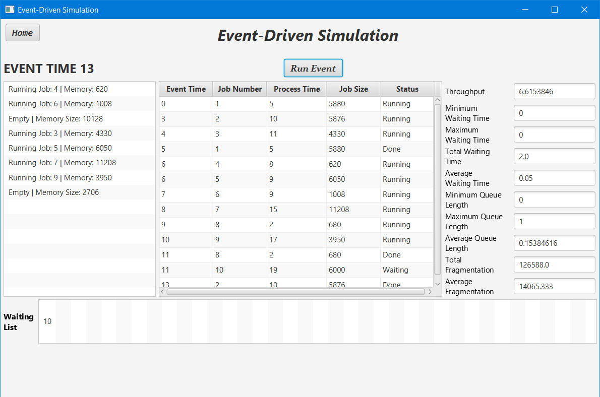

# CST-232-Memory-Allocation-Simulation
The program simulates fixed and dynamic memory allocation when processing a list of jobs.

JobList.txt contains a list of jobs with the job number, arrival time, process time, and job size. The first line of the file indicates the total number of jobs.

MemoryList.txt records the size of each memory block for fixed memory allocation.

The GUI is created using JavaFX Scene Builder. Please install JavaFX with the vm arguments configured in your IDE.

The whole program is co-created with my assignment teammates Tan Chi Feng and Heng Kai Xuan.

